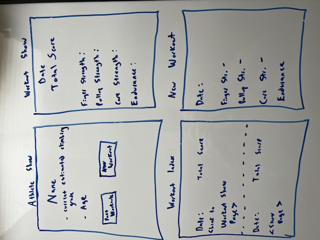
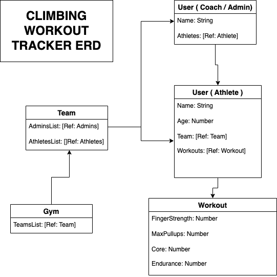

# Climber-Fitness-Tracker

The Climber Fitness Tracker is a way to store and access workout data for climbing workouts. Coaches will be able to view all athletes' workout data, and each athlete will be able to see their own workouts. 

Technologies used:

-Node
-MongoDB
-Express
-Mongoose
-CSS

The users will be able to:

Users will be able to sign up and log in after entering their basic information. They will be able to add a new workout, which will have a schema for 4 climbing-related benchmarks to quanify the user's level of strength. These benchmarks will give the user an output of what climbing grade their benchmarks suggest they can climb. 

Coaches will be authorized to view all of their athletes' workouts. They can view changes and trends in athlete benchmarks to help formulate a training plan for each athlete. 

The Wireframes:

The ERD: 

Route Table:

<table>
    <tr>
        <td>Hello</td>
    <tr>
</table>

MVP Requirements: 

Athletes will be able to sign up / sign in and add workouts to their show page. They will be able to track all of their previous workouts and edit/delete as necessary

Coaches will be able to sign up / sign in and view all athletes and their individual workouts

Stretch Goals:

Have 3 different types of workouts:
    [] Strength benchmarks
    [] Physical measurements
    [] Training log

Create a tracker that visualizes benchmark progress (graph, chart, etc). Alerts coach if 1 of the 4 benchmarks has decreased by a certain percentage

Make it possible for athletes to share their benchmarks with other athletes if they want to

Arrange athletes by teams to make it easier for coaches to organize them

Make it easy to search for individual athletes

Use an API to get the athlete's membership info? Get their image?

Make it possible for coaches to send athletes individual messages