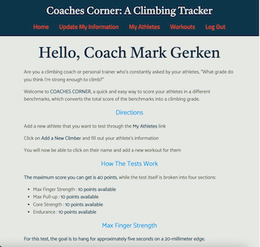
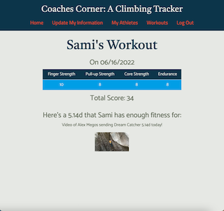
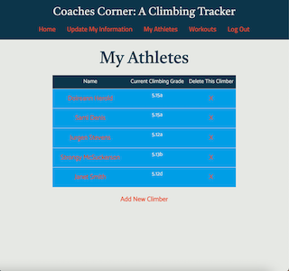

# Coaches Corner
https://coachescorner.herokuapp.com/

Are you a climbing coach or personal trainer who's constantly asked by your athletes, "What grade do you think I'm strong enough to climb?"

Welcome to COACHES CORNER, a quick and easy way to score your athletes in 4 different benchmarks, which converts the total score of the benchmarks into a climbing grade.

## Technologies used:

-Node
-MongoDB
-Express
-Mongoose
-Liquid
-CSS / Bootstrap

## The users will be able to:

Users will be able to sign up and log in after entering their basic information. They will be able to add a new workout, which will have a schema for 4 climbing-related benchmarks to quanify the user's level of strength. These benchmarks will give the user an output of what climbing grade their benchmarks suggest they can climb. 

Coaches will be authorized to view all of their athletes' workouts. They can view changes and trends in athlete benchmarks to help formulate a training plan for each athlete. 

## The Wireframes:
Home Page

Workout Show Page

Athletes Index Page

## The ERD: 

## Route Table:

<table>
    <tr>
        <th>HTTP Method</th>
        <th>Path</th>
        <th>CRUD Operation</th>
    </tr>
    <tr>
      <td>GET</td>  
      <td>/createUser</td>  
      <td>Create an athlete or coach</td>  
    </tr>
    <tr>
      <td>GET</td>  
      <td>/login</td>  
      <td>Sign in</td>  
    </tr>
    <tr>
      <td>GET</td>  
      <td>/athletes</td>  
      <td>Athletes index page</td>  
    </tr>
    <tr>
      <td>GET</td>  
      <td>/athletes/:id</td>  
      <td>Athlete show page</td>  
    </tr>
    <tr>
      <td>GET</td>  
      <td>/athletes/:id/workouts</td>  
      <td>Workouts index page for the athlete</td>  
    </tr>
    <tr>
      <td>GET</td>  
      <td>/athletes/:id/workouts/new</td>  
      <td>Create a new workout to the athlete</td>  
    </tr>
    <tr>
      <td>POST</td>  
      <td>/athletes/:id</td>  
      <td>Add new workout to athlete</td>  
    </tr>
</table>

## MVP Requirements: 

Athletes will be able to sign up / sign in and add workouts to their show page. They will be able to track all of their previous workouts and edit/delete as necessary

Coaches will be able to sign up / sign in and view all athletes and their individual workouts

## Stretch Goals:

Create a tracker that visualizes benchmark progress (graph, chart, etc). Alerts coach if 1 of the 4 benchmarks has decreased by a certain percentage

Make it possible for athletes to share their benchmarks with other athletes if they want to

Arrange athletes by teams to make it easier for coaches to organize them

Make it easy to search for individual athletes

Make it possible for coaches to send athletes individual messages